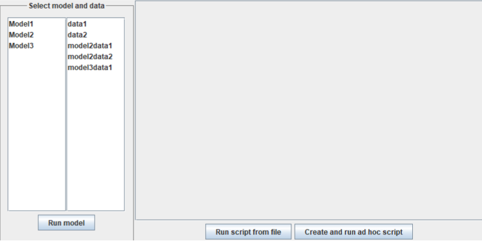
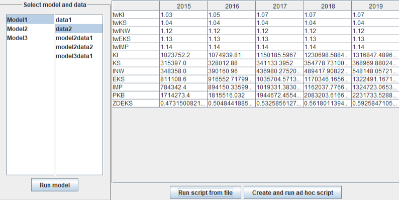

# Reflective Scripting

## Overview
This project is a **simulation model framework** that allows for performing calculations over defined periods (e.g., years) using Java. It provides **Model definitions** for calculations, a **Controller** to manage data input, execute models, and process results, integration with **scripts** (e.g., Groovy or Python) to extend functionality and a **Graphical User Interface (GUI)** for interacting with models and scripts.
The project emphasizes flexibility in handling simulation models, managing input data, and generating results dynamically.

## Features
- **Model Definition**:
    - Models consist of variables (`@Bind` annotations) and methods (`run`) to perform calculations.
    - Supports auxiliary fields and methods for additional logic.
- **Controller**:
    - Handles data input from files.
    - Runs simulation models and associated scripts.
    - Exports results in a **tab-separated values (TSV)** format.
- **Script Integration**:
    - Supports external scripts (e.g., Groovy) for extended calculations.
    - Scripts can access model variables and define new variables for results.
- **Graphical User Interface (GUI)**:
    - Interact with models and scripts through an intuitive interface.
    - View and modify input data and results in real-time.

## Screenshots
### Main GUI interface

### Results output


## Technologies Used
- **Programming Language**: Java
- **Scripting Support**: Groovy
- **GUI Framework**: Java Swing
- **Development Environment**: IntelliJ IDEA

## How to use
- **Defining models**
    - Models are defined in the models package.
    - Use the `@Bind` annotation to mark fields for input/output. 
    - Implement the `run()` method for calculations.
- **Input Data**
    - Input files define variables and their values. Example:
    ```
    LATA 2015 2016 2017 2018 2019
    twKI 1.03
    twKS 1.04
    KI 1023752.2
    KS 315397
    ```
- **Using the Controller**
    - Example:
    ``` Java
  Controller controller = new Controller("Model1");
    ctl.readDataFrom("data1.txt")
    .runModel()
    .runScriptFromFile("script1.groovy");
    System.out.println(ctl.getResultsAsTsv());
    ```
- **Scripts**
    - Example `Groovy` script for calculating export capacity:
    ``` Groovy
    ZDEKS = new double[LL];
    for (i = 0; i < LL; i++) {
    ZDEKS[i] = EKS[i] / PKB[i];
    }
    ```

## File Structure
- `Main.java` - Entry point of the program
- `src/main/java/Annotations` - Directory made for annotations of the program
- `src/main/java/Main` - Directory with general classes
- `src/main/java/Main` - Directory dedicated for Models files
- `src/res/Data` - Directory dedicated for Data files
- `src/res/Scripts` - Directory dedicated for Scripts files
- `README.md` - Project documentation
- `LICENSE` - Project license

## License
This project is licensed under the MIT License
